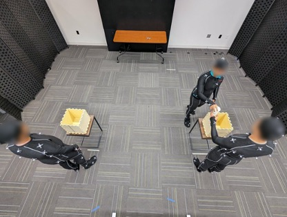
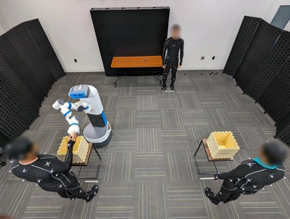

# Interact: A Large-scale multimodal dataset comprising  human-human and human-robot collaboration data 

[**Paper**](paper.pdf)
| [**Website**](https://clvrai.com/furniture-bench/)
| [**Documentation**](https://clvrai.github.io/furniture-bench/docs/index.html)


It features
- Human-Human and Human-Robot Collaboration Tasks
- Vaariations to investigate the impact of obstacles on human motion
- 3-D Skeleton data, RGB+D data from two viewpoints, ego-view of two participants
- Large-scale dataset (252 episodes)


## Interact-HHC


Comprises Human-Human Collaboration (3 Humans) data on a simulated assembly task [link](datasets).


## Interact-HHC


Comprises Human-Robot Collaboration (3 Humans + 1 Robot) data on a simulated assembly task [link](datasets).

## Citation

If you find this dataset useful for your research, please cite this work:
```
@inproceedings{yasar2024PoseTron,
    title={PoseTron: Enabling Close-Proximity Human-Robot Collaboration Through Multi-human Motion Prediction},
    author={Mohammad Samin Yasar and Md. Mofijul Islam and Tariq Iqbal},
    booktitle={Human Robot Interaction},
    year={2024}
}
```

